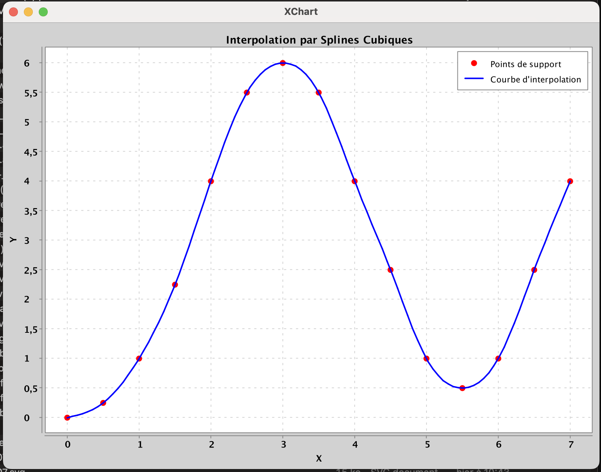

# TP5 - Interpolation par Splines Cubiques

## Auteur
**Hamadou BA**  

## Description
Ce projet implémente l'interpolation par splines cubiques pour des fonctions réelles d'une variable réelle. L'application permet de lire des points de support depuis un fichier, de calculer l'interpolation par splines cubiques et d'afficher le résultat graphiquement.

L'interpolation par splines cubiques est une méthode qui permet de construire une fonction continue et deux fois dérivable passant exactement par un ensemble de points donnés. Cette méthode est particulièrement utile pour obtenir une interpolation lisse entre des points de données.

## Structure du projet

### Classes principales
- **Spline.java**: Classe principale réalisant l'interpolation par splines cubiques
- **DataOutOfRangeException.java**: Exception personnalisée levée lorsqu'on tente d'évaluer la fonction hors des limites
- **App.java**: Programme principal avec interface utilisateur et affichage graphique

### Fonctionnalités
1. Lecture de points de support depuis un fichier texte
2. Calcul de l'interpolation par splines cubiques
3. Évaluation de la fonction d'interpolation sur 100 points répartis uniformément
4. Affichage graphique des points de support et de la courbe d'interpolation

## Exemple de données et résultat

### Points de support utilisés
```
# Format: x y
# Points pour tester la fonction d'interpolation
0.0 0.0
0.5 0.25
1.0 1.0
1.5 2.25
2.0 4.0
2.5 5.5
3.0 6.0
3.5 5.5
4.0 4.0
4.5 2.5
5.0 1.0
5.5 0.5
6.0 1.0
6.5 2.5
7.0 4.0
```

### Résultat graphique


Sur cette image, on peut voir:
- Les points de support (en rouge)
- La courbe d'interpolation par splines cubiques (en bleu)

## Dépendances
- **Maven**: Gestion des dépendances et du cycle de vie du projet
- **XChart**: Bibliothèque pour l'affichage graphique des résultats

```xml
<dependency>
    <groupId>org.knowm.xchart</groupId>
    <artifactId>xchart</artifactId>
    <version>3.8.3</version>
</dependency>
```

## Installation et exécution

### Prérequis
- Java 17 ou supérieur
- Maven 3.6 ou supérieur

### Installation
1. Cloner le dépôt:
   ```bash
   git clone https://www-apps.univ-lehavre.fr/forge/bh243413/tp5-ps-splines-cubiques.git
   cd tp5-ps-splines-cubiques
   ```

2. Compiler le projet:
   ```bash
   mvn clean compile
   ```

### Exécution
Lancer le programme principal:
```bash
mvn exec:java -Dexec.mainClass="tp5.ps.App"
```

## Format du fichier de points
Le programme lit les points de support depuis un fichier texte dont le format est le suivant:
- Un point par ligne
- Coordonnées x et y séparées par un espace, une tabulation ou une virgule
- Les lignes commençant par `#` sont ignorées (commentaires)

## Algorithme d'interpolation
L'implémentation utilise l'algorithme de Thomas (résolution d'un système tridiagonal) pour calculer les dérivées secondes aux points de support, puis construit des polynômes cubiques par morceaux entre chaque paire de points adjacents.

## Licence
Ce projet est réalisé dans le cadre d'un TP universitaire et n'est pas soumis à une licence particulière.
